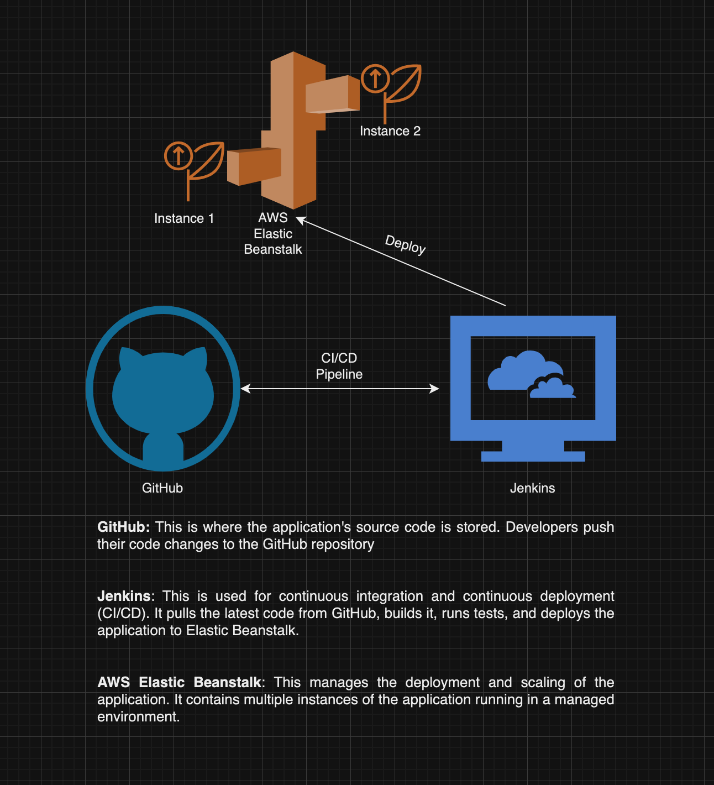
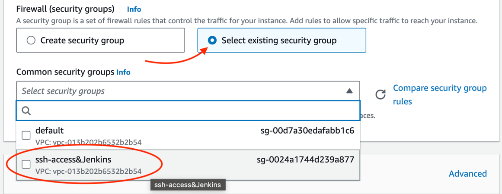

**Purpose:**

The purpose of this app is to offer banking clients self-service
features within an online environment. This allows them to manage their
accounts with ease.

   
**Optimization:**

 While using the managed AWS service (Elastic Beanstalk) we can
guarantee the service will always be running and able to support the
traffic without bottlenecks. This also simplifies deployment and
management with the Jenkins CI/CD pipeline. While updating the app is
simple and quick, managed services can pose a security risk because it’s
not being managed internally. It may also complicate any legal and
regulatory compliance that has to be followed for financial
institutions. Improper configuration with auto-scaling might lead to
downtime or latency, it could also be more costly. Using a managed
service may not have the functionality to integrate third-party plugins
or apps if needed.

**Troubleshooting:**

- **I cannot exit systemctl status after checking the status of
  Jenkins**

*Click “q” to exit*

- **Cannot connect to Jenkins, my browser blocked it.**

*Use a less secure browser, or by pass the warning message by continuing
with a link on the error the page. (Safari works over Opera GX). Make
sure you are using the public IP listed in the AWS Instance specs page
to connect and “:8080/” follows. This IP is not static and will change
periodically.*

- **Jenkins is not loading.**

*Jenkins requires a little time to load up the page, sometimes it may
lag between communications.*

- **Cannot connect to GitHub**

*Check the personal access token, this can only be seen once, so if you
do not have it delete the old token for security purposes and create a
new one to re-connect.*

*Check whether the repository is private or public. Private repos may
require additional configuration.*

- **I only see one Policy under permissions policies in the IAM
  settings.**  
  *You may only see one policy at a time, but as long as its checked you
  can confirm the number of selected policies at the top \[ie 3/945\]*

- **After deploying the app I get a 502 error and the app is not
  live.**  
  *For Windows users, When uploading the deployment package to AWS
  (.ZIP), make sure there are no internal directory folders within the
  archive. For mac users, this may not be the case, but the .ZIP
  downloaded directly from the github repo is not sufficient. UnZip and
  the re-ZIP the files using the native system compression (i.e. select
  all files within the folder, right-click, select “compress”) method
  before uploading to AWS.*

**Draw.IO:**

**  

  
**Steps:**

Below are the steps taken to create this banking app running Jenkins in
AWS Elastic Beanstalk.

**Clone the Repository:**

1.  Copied the link to clone the repository from the Kura Github:  
    [<u>https://github.com/kura-labs-org/C5-Deployment-Workload-1.git</u>](https://github.com/kura-labs-org/C5-Deployment-Workload-1.git)

2.  Navigate back to your personal repository and click the "+" button
    and select "Import Repository"

3.  Paste the URL of the above repository into the source URL box, name
    your new repository and select public/private. Click "Begin Import".
    Git will email you when the clone has finished copying over to your
    repository.

 
**Create an EC2:** 

1.  Navigate to the AWS EC2 Dashboard. Create a "t2.micro" Ubuntu EC2
    instance with the following security group settings:

>  

1.  Under “security group rules”:  
    Type:“ SSH” (port should automatically be 22) and “source-
    0.0.0.0/0”

<!-- -->

2.  Click on “add security group rule”:  
    Type: "HTTP” (port should automatically be 80) and “source-
    0.0.0.0/0”

3.  Add another rule for “type- Custom TCP”, “port- 8080”, “source-
    0.0.0.0/0” (Supports Jenkins)

<!-- -->

2.  Make sure to create Key pair and name it. After key is created it
    will download to the local system. DO NOT lose this key, it is
    necessary to access the EC2  
    Key Pair Type: "RSA" \| Private Key File Format: ".pem"

>  
>
> ***<u>NOTE</u>***: *If the security group was created prior to, select
> it from the "select existing security group"  
> *

**Install Jenkins on the EC2:**  
 

1.  Connect to the EC2 instance and run the following commands to
    install.

>  

- *sudo apt update && sudo apt install fontconfig openjdk-17-jre
  software-properties-common && sudo add-apt-repository
  ppa:deadsnakes/ppa && sudo apt install python3.7 python3.7-venv*

- *sudo wget -O /usr/share/keyrings/jenkins-keyring.asc
  [<u>https://pkg.jenkins.io/debian-stable/jenkins.io-2023.key</u>](https://pkg.jenkins.io/debian-stable/jenkins.io-2023.key)*

- *echo "deb \[signed-by=/usr/share/keyrings/jenkins-keyring.asc\]"
  [<u>https://pkg.jenkins.io/debian-stable
  binary/</u>](https://pkg.jenkins.io/debian-stable%20binary/) \| sudo
  tee /etc/apt/sources.list.d/jenkins.list \> /dev/null*

- *sudo apt-get update*

- *sudo apt-get install jenkins*

- *sudo systemctl start jenkins*

- *sudo systemctl status Jenkins*

- 

2.  After the final command (status) Jenkins should be active, Enter "q"
    to quit the systemctl status output.

**Login to Jenkins:**  
 
1.  Navigate to AWS to locate the "public Ipv4 address" of the EC2
    instance created for the banking app. The IP information is located
    under the instance summary.  
     

>  alt="Instance summary for i-Of93509cec00762ee (Bank Actions Updated about 1 hour ago Instance ID 61 i-Of93509cec00762ee (Banking) IPv6 address Public IPv4 address 61 54.152.222.99 | Instance state " />

 

2.  On a web browser copy/paste the public IT into the following link to
    connect to Jenkins:

> [<u>http://server_ip_address:8080</u>](http://server_ip_address:8080)
> ***<u>NOTE</u>***: the public IP is not static.
>
>  

3.  Jenkins will load and request an administrator password. This
    initial administrator password can be found by running the following
    command in the linux terminal as shown:  
     

- *sudo cat /var/lib/jenkins/secrets/initialAdminPassword  
  *

>  alt="Not Secure — 54.152.222.99 e Getting Started Unlock Jenkins To ensure Jenkins is securely set up by the administrator, a password has the log (not sure where to find it?) and this file on the server: /va r/ lib/ j enkins/sec rets/ initia IAdminPasswo rd Please copy the password from either location and paste it below. Administrator password " />

4.  Install all the apps recommended by the community by clicking
    "Install Suggested Plugins". The following page will load and
    install all necessary files.

>  alt="Getting Started Customize Jenkins Plugins extend Jenkins with additional features to support n Install suggested plugins Install plugins the Jenkins community finds most useful. Select plugins install Select and install suitable for your n " />

5.  When its complete, The Getting Started window will appear and
    require the first admin user be created. Create a user. Save and
    Continue.

6.  Make sure to confirm the Jenkins URL, the select "Save and Finish".
    Congrats! The Jenkins setup is complete. Click the "Start using
    Jenkins" button.

> **Create a Multi-Branch Pipeline:**  
>  

1.  In the main menu of Jenkins, Click “new Item” in the menu on the
    left of the page.

2.  Enter a name for your pipeline, Choose “Multibranch Pipeline”

3.  Under “Branch Sources”, click “Add source” and select “GitHub”. Then
    Click “+ Add” and select “Jenkins”.  
     

4.  Make sure under the Kind section that “Username with password” is
    selected. Under scope, make sure "Global" is selected. Under
    “Username”, enter your GitHub username. Under “Password”, enter your
    GitHub personal access token.

>  

5.  To get a personal access token from Github: In the upper-right
    corner of any GitHub browser page, click the profile photo, then
    click "Settings".  
     

6.  In the left sidebar, click "Developer settings". In the left
    sidebar, under Personal access tokens, click "Tokens (classic)".
    Select "Generate new token", then click "Generate new token
    (classic)". Select "read/write packages" permissions.  
     

> 

7.  Select the credentials you have created for Github from the dropdown
    menu then Add the URL of the repository in the "Repository HTTPS
    URL" box. Then click the "Validate" button.  
      
    ***<u>NOTE:</u>*** Issues may occur if the Repository is private.

8.  Scroll down to the Build Configuration section, Make sure that the
    "Mode" & "Script Path" both have "Jenkinsfile" selected. Click
    "Save" to start the build.

9.  Once the build finishes, the successful log will post.

> **Create IAM Roles & Permissions:**

1.  Navigate to AWS, then "Roles" under the IAM settings. Click "Create
    Role". Select "AWS Service. Scroll down and select "Elastic
    Beanstalk" from the dropdown menu under the User Case section. Click
    the radio button for "Elastic Beanstalk - Customizable". Click
    "Next". Then click "Next" again.  
     

 

2.  Click the Role Name box and type
    "aws-elasticbeanstalk-service-role". Click "Create Rule", then Click
    "Create Role" once more for the second role.

>  alt="@ Role aws-elasticbeanstalk-service-role created. IAM &gt; Roles (6) Info Roles c An IAM role is an identity you can create that has specific permissions with credentials that are valid for short by entities that you trust. Q Search Role name " />

3.  Select "AWS Service". Scroll down and select "EC2" from the dropdown
    menu under the User Case section. Click the radio button for "EC2 -
    Allows EC2 instances to call AWS services on your behalf". Click
    "Next".  
     

4.  Search for the following Permissions Policies and check the box next
    to them. After all 3 have been checked, Click "Next".

    1.  *AWSElasticBeanstalkWebTier*

    2.  *AWSElasticBeanstalkWorkerTier*

    3.  *AWSElasticBeanstalkMulticontainerDocker  
          
        **<u>NOTE</u>**:* If only one policy shows, double check the
        number of checked boxes located next to the Permissions Policies
        title \[ex. 3/945\]

1.  Enter "Elastic-EC2" as the role name. Scroll down and click "Create
    Role".

>  
>
>  
>
>  
>
> **Create the Elastic Beanstalk & Deploy:**

1.  Navigate to the AWS Elastic Beanstalk console, then click
    Environment (in the left menu) and "Create an Environment" with the
    following settings:  
     

    - *Environment Tier: Web server Environment*

    - *App Name: Banking Web App (Environment name will auto populate)*

    - *Managed Platform: Python 3.7*

    - *Upload Code: Local .ZIP File (saved from GitHub Repo)*

    - *Presets/Environment Type: Single Instance (free tier eligible)*

    - *Instance Type: t3.micro*

    - *Existing Service Roll: aws-elasticbeanstalk-service-role/EC2
      Profile*

    - *VPC: Default*

    - *Subnet: us-east-1a*

    - *Root Volume Type: General Purpose (SSD), 10GB*

    - *Monitoring: Basic Health Reporting (NOT ENHANCED)*

>  

2.  Click "Submit" following the review page. Click the link in the
    domain to confirm app has deployed.
>
